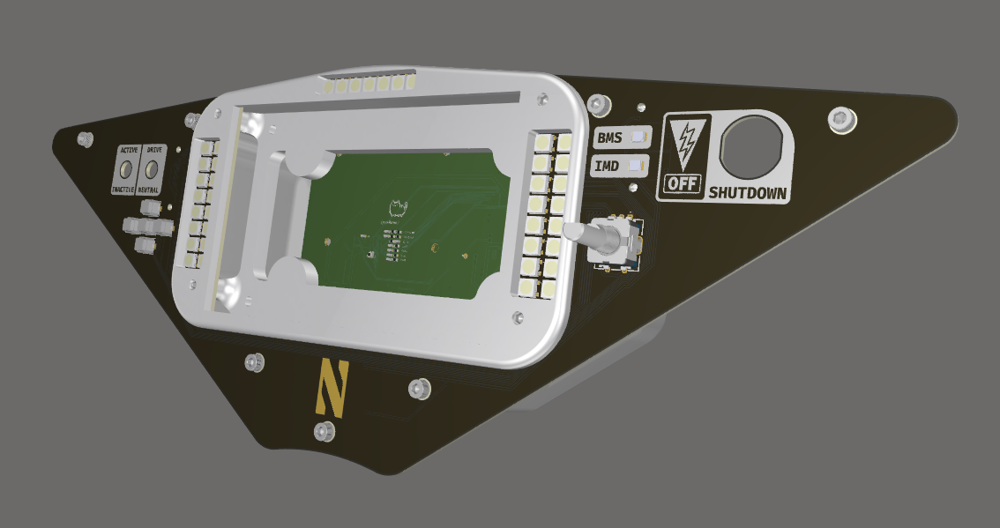
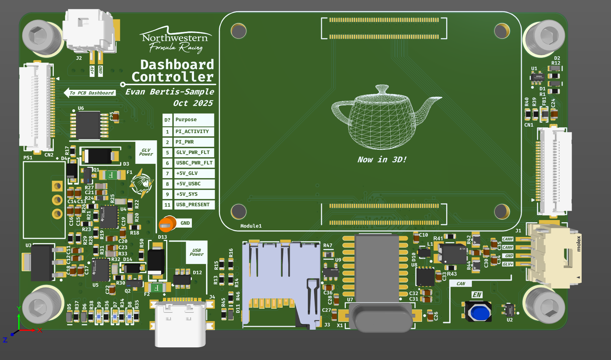

<div align="center">
    
    
</div>

# daq-dash-26

Software for `NFR26` dashboard, built upon `Okay Engine` and a custom `Raspberry Pi Compute Module 4` carrier board.

## Installation (Running Locally)

### Prerequisites

* `Okay-Engine`, and all of it's prerequisites

### Steps

After installing and verifying okay-engine, you can run the project by running:

```sh
cd dash
okay init
okay build
okay run
```

This will build and run the project locally. If you are developing any okay-project within the directory, it is suggested that you run

```sh
okay index
```
in the root of the `daq-dash-26` repository. This will generate a `.clangd` file, which provides intellisense for development.

## Installation (Running in Raspbian OS Lite, QEMU)

It is suggested to get setup with QEMU and an image of Raspbian OS Lite if you are developing platform-specific code. This section will be setup eventually.

## Updating Dashboard Controller Board

Dashboard Controller Board is designed to act as an ethernet device over USB. Using `sftp` and `ssh`, you can update the software on the controller board.

Before updating the code on the board, make sure that there is an SD card with the `raspbian os lite` operating system in the controller board. Then, using a cable that supports USB 2.0, connect the controller board to your computer.

You can then test the connection of to the controller board:

```sh
ssh nfr@raspberrypi.local
```

You should be able to ssh into the raspberry pi, at which point you are safe to update the controller board code.

First, exit your ssh session (if you tested your connection):

```sh
exit
```
Then, run the `setup_pi.sh` script.

```sh
./scripts/setup_pi.sh
```

This will take your current version of `daq-dash` code, copy it over, then recompile the project. It should also reboot the controller board for a cold start.